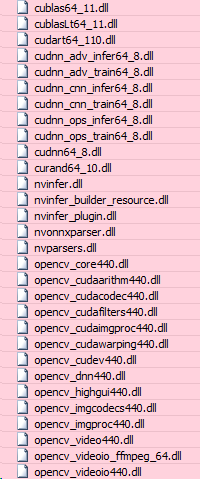

# Deploy yolov7-pose TensorRT for Windows

## References

Official yolov7 implement: https://github.com/WongKinYiu/yolov7

Official yolov7-pose implement: https://github.com/WongKinYiu/yolov7/tree/pose

Deploy Yolov7-pose with TensorRT for Linux: https://github.com/nanmi/yolov7-pose

# Installation

  install torch and related package

  ```shell
  # python 3.7 (or higher) is recommended

  pip3 install torch==1.8.2 torchvision==0.9.2 torchaudio===0.8.2 --extra-index-url https://download.pytorch.org/whl/lts/1.8/cu111

  pip3 install -r requirements.txt
  
  # Install onnxsim
  pip3 install onnxsim
  
  # Install onnx_graphsurgeon
  # if not ok
  pip3 install onnx_graphsurgeon
  # try 
  python -m pip install onnx_graphsurgeon --index-url https://pypi.ngc.nvidia.com
  ```

# Build projects on Windows

TensorRT-8.2.4.2

Opencv-4.4.0

Cuda Toolkit 11.1, cudnn-11.1

Based on Deploy [Yolov7-pose with TensorRT for Linux](https://github.com/nanmi/yolov7-pose), we change configurations to build on Windows

For dirent include files: download [dirent source code](https://github.com/tronkko/dirent)


## Build projects **[using attached files - modified after build from the original source]**

Python code:

  - Use "export_pose_all.py" to convert [yolov7-w6-pose.pt](https://github.com/WongKinYiu/yolov7/releases/download/v0.1/yolov7-w6-pose.pt) model to final onnx model to apply in main C++ program.
  - Ouput onnx model name: yolov7-w6-pose-s%d-b%d-sim-yolo.onnx (s%d: size of model, b%d: batch-size)
  - Currently, model size 448 is suitable with our application for real-time processing (gerneral model input-size: yolov4: 416, yolov7: 480, yolov7-pose: 448)
     
Program's main funtions:

  - Convert "yolov7-w6-pose-s448-b8-sim-yolo.onnx" model to "yolov7-w6-pose-sim-yolo-fpxx.engine" TensorRT engine
  - Apply batch-size to process multi images one time
  - Inference test images / save result images with generated TensorRT engine
    
Notice:

  - Plugin is generated based on model size (inlcuded in current project: 448x448, 640x640 plugin)
  - Generate "yolov7-w6-pose-sim-yolo.onnx" model as explained as bellow [click here](http://10.10.15.183:8088/VAS/SmartFactory_DLL/blob/master/test_yolov7_pose_TRT/README.md#build-onnx-models-and-tensorrt-engine-by-using-generated-plugin)
  - Copy libraries to main folder to run program
  
    </img>

Result

</img> 

## Build projects **[if you want to build directly from the [original source](https://github.com/nanmi/yolov7-pose)]**

#### YoloLayer_TRT_v7.0: generate plugin library to build tensorRT engine

  - Change CMakeLists.txt to build on Windows

    ```shell
    ...
    set(CMAKE_CXX_FLAGS "${CMAKE_CXX_FLAGS} -std=c++11 -Wall -Ofast -D_MWAITXINTRIN_H_INCLUDED")
    ...
    set(TENSORRT_INCLUDE_DIR D:/Library/TensorRT-8.2.4.2/include/)
    set(TENSORRT_LIBRARY_DIR D:/Library/TensorRT-8.2.4.2/lib/)
    ```
    
  - Use CMake (cmake-gui) on Windows to build project, fix paths to Generate

    </img> </img>   

  - Open ".sln" file with Visual Studio, right click for project on "Solution Explorer" tab to change "Build Dependencies / Build Customizations" to CUDA 11.x
  - Open yolo project Properties, change Target Name to yololayer
  - Right click on "yololayer.cu", in tab "General", change Item Type to "CUDA C/C++"
  - Make sure paths and name for libraries in Linker tab are correct (Cuda Toolkit, cudnn, TensorRT)
  
    ```shell
    cudart.lib;cublas.lib;cudnn.lib;cudnn64_8.lib;nvinfer.lib;nvinfer_plugin.lib;nvonnxparser.lib;nvparsers.lib
    ```
    
  - In tab "CUDA C/C++" of yololayer.cu Properties -> Command Line -> additional Options: -DAPI_EXPORTS
  - In tab "Linker" of project Properties -> Advanced -> Import Library -> change "yolo.lib" to "yololayer.lib"
  - Remove "Object Files" of yolo project on "Solution Explorer" tab
  - Build project, get "yololayer.dll" and "yololayer.lib" in "YoloLayer_TRT_v7.0/build/Release" folder

#### Build ONNX models and TensorRT engine by using generated plugin

  - Download [Official yolov7 implement](https://github.com/WongKinYiu/yolov7), [yolov7-w6-pose.pt](https://github.com/WongKinYiu/yolov7/releases/download/v0.1/yolov7-w6-pose.pt), add following code to make "export_pose.py"
  
    ```shell
    import sys
    sys.path.append('./')  # to run '$ python *.py' files in subdirectories
    import torch
    import torch.nn as nn
    import models
    from models.experimental import attempt_load
    from utils.activations import Hardswish, SiLU

    # Load PyTorch model
    weights = 'yolov7-w6-pose.pt'
    device = torch.device('cuda:0')
    model = attempt_load(weights, map_location=device)  # load FP32 model

    # Update model
    for k, m in model.named_modules():
        m._non_persistent_buffers_set = set()  # pytorch 1.6.0 compatibility
        if isinstance(m, models.common.Conv):  # assign export-friendly activations
            if isinstance(m.act, nn.Hardswish):
                m.act = Hardswish()
            elif isinstance(m.act, nn.SiLU):
                m.act = SiLU()
    model.model[-1].export = True # set Detect() layer grid export
    model.eval()

    # Input
    img = torch.randn(1, 3, 960, 960).to(device)  # image size(1,3,320,192) iDetection
    torch.onnx.export(model, img, 'yolov7-w6-pose.onnx', verbose=False, opset_version=12, input_names=['images'])
    ```
  
  - Generate "yolov7-w6-pose.onnx" model by using "export_pose.py"
  - Generate "yolov7-w6-pose-sim.onnx" model by this command:

    ```shell
    onnxsim yolov7-w6-pose.onnx yolov7-w6-pose-sim.onnx
    ```
  
  - **NOTICE for Tensor Name**: tensors names in file "YoloLayer_TRT_v7.0/script/add_custom_yolo_op.py" are names of old version of "yolov7-w6-pose.pt", to check new tensors name:
    
    - Open [netron.app](https://netron.app/), open Model "yolov7-w6-pose-sim.onnx"
    - "Ctrl + F" to search "Transpose" layers, there will be 4 Transpose layers

      </img>
      
    - For each Transpose layer, find "concat" layer above it to check "outputs" name
    
      </img>
    
    - Change tensors names in "add_custom_yolo_op.py" based on "Concat" output names checked above 

      ```shell
      inputs = [tensors["745"].to_variable(dtype=np.float32), 
      tensors["802"].to_variable(dtype=np.float32),
      tensors["859"].to_variable(dtype=np.float32),
      tensors["916"].to_variable(dtype=np.float32)]
      ```
    - Generate "yolov7-w6-pose-sim-yolo.onnx" model by using "add_custom_yolo_op.py"
    
  - **(1) Build TensorRT engine **
    - Copy "yololayer.dll" and "yololayer.lib" in "YoloLayer_TRT_v7.0/build/Release" folder to "D:/Library/TensorRT-8.2.4.2/bin"
    - Copy all ".dll" files from "D:/Library/TensorRT-8.2.4.2/lib" to "D:/Library/TensorRT-8.2.4.2/bin"
    - Copy "yolov7-w6-pose-sim-yolo.onnx" model to "D:/Library/TensorRT-8.2.4.2/bin"
    - Run below command to build TensorRT engine:
    
      ```shell
      # float 16
      trtexec --onnx=yolov7-w6-pose-sim-yolo.onnx --fp16 --saveEngine=yolov7-w6-pose-sim-yolo-fp16.engine --plugins=yololayer.dll
      
      # float 32
      trtexec --onnx=yolov7-w6-pose-sim-yolo.onnx --saveEngine=yolov7-w6-pose-sim-yolo-fp32.engine --plugins=yololayer.dll
      ```
      
#### yolov7-pose: test program with generated TRT engine

  - Change CMakeLists.txt to build on Windows

    ```shell
    ...
    set(CMAKE_CXX_FLAGS "${CMAKE_CXX_FLAGS} -std=c++11 -Wall -Ofast -g -D_MWAITXINTRIN_H_INCLUDED")
    ...
    set(TENSORRT_INCLUDE_DIR D:/Library/TensorRT-8.2.4.2/include/)
    set(TENSORRT_LIBRARY_DIR D:/Library/TensorRT-8.2.4.2/lib/)
    ```
  - Use CMake (cmake-gui) on Windows to build project, fix paths to Generate (there are additional directories in compared with YoloLayer_TRT_v7.0)
  - Open ".sln" file with Visual Studio, right click for project on "Solution Explorer" tab to change "Build Dependencies / Build Customizations" to CUDA 11.x
  - Right click on "yololayer.cu", in tab "General", change Item Type to "CUDA C/C++"
  - Make sure paths and name for includes in C/C++ tab and libraries and Linker tab are correct (Cuda Toolkit, cudnn, opencv, TensorRT)
  
    ```shell
    cudart.lib;cublas.lib;cudnn.lib;cudnn64_8.lib;nvinfer.lib;nvinfer_plugin.lib;nvonnxparser.lib;nvparsers.lib;
    opencv_cudafeatures2d440.lib;opencv_cudaobjdetect440.lib;opencv_cudastereo440.lib;opencv_highgui440.lib;opencv_dnn440.lib;opencv_cudacodec440.lib;
    opencv_videoio440.lib;opencv_cudawarping440.lib;opencv_video440.lib;opencv_imgcodecs440.lib;opencv_objdetect440.lib;opencv_calib3d440.lib;opencv_features2d440.lib;
    opencv_flann440.lib;opencv_photo440.lib;opencv_cudaimgproc440.lib;opencv_cudafilters440.lib;opencv_imgproc440.lib;opencv_cudaarithm440.lib;opencv_core440.lib;opencv_cudev440.lib
    ```
    
  - Remove "Object Files" of project on "Solution Explorer" tab
  - Build project
  - Copy TensorRT engine generated from (1), "person.jpg" image and libraries to "build/Release" folder and check the result
